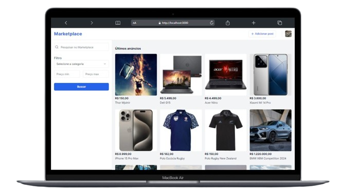
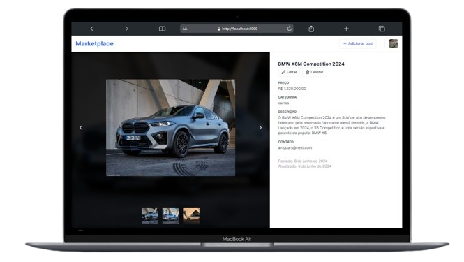
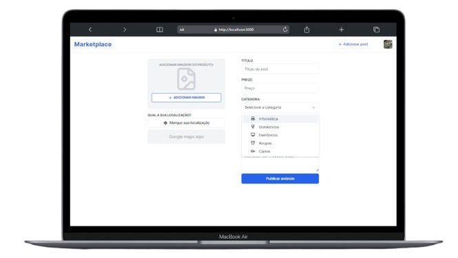
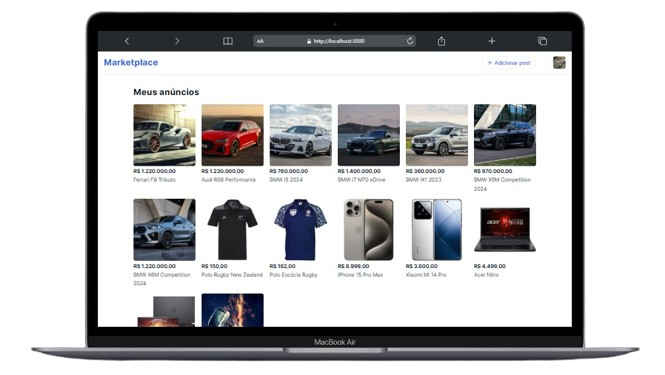
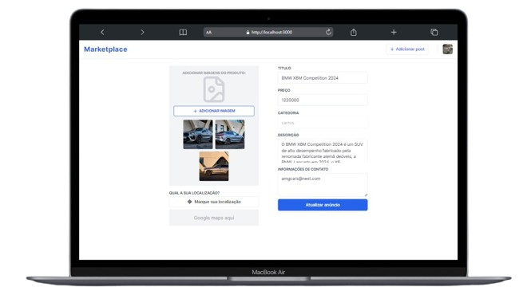
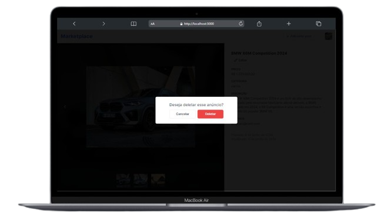

## Marketplace Clone
Este é um clone de um sistema de marketplace, desenvolvido com [NextJS](https://nextjs.org/). 

&nbsp;
## 👀 Saiba mais
Este projeto é um sistema de vendas online, onde o usuário pode adicionar posts dos seus produtos com fotos, preço, descrição, contatos e localização (função em construção).

No ícone da foto do usuário no header da aplicação ao clicar abre um menu logo abaixo com os links das seções do usuário, onde ele pode visualizar as opções de logout ou seus post criados, podendo editar ou remover da home page. Os post só poderão ser editados ou excluídos somente pelo usuário que os criou, pois a aplicação conta com um sistema de autenticação de login para cada cliente. 
No final deste documento poderá visualizar os layouts do projeto. 👍🏻

As tecnologias utilizadas para o desenvolvimento foram:

✔ Typescript &nbsp;
✔ Tailwind CSS &nbsp;
✔ Next Auth &nbsp;

✔ ImageKit &nbsp;
✔ Shadcn/ui &nbsp;
✔ Mongoose

&nbsp;
## 👨🏻‍💻 Começando...
Após criar um novo projeto utilizando o NextJS com typescript e configurar todas as tecnologias citadas acima, o projeto utiliza o Mongo db para guardar os dados dos posts.
Deve-se criar um banco de dados no site [MongoDB Atlas](https://www.mongodb.com/).

Um arquivo `.env` deverá ser criado na raiz do projeto onde você irá inserir todos os dados de comunicação do banco e suas chaves privadas e públicas de autenticação de login. Segue um modelo de chaves para criação:

```
Para autenticação de login com o provedor Google:
GOOGLE_CLIENT_ID
GOOGLE_CLIENT_SECRET

Para autenticação com o ImageKit, responsável por armazenar as images do post:
NEXT_PUBLIC_URL_ENDPOINT
NEXT_PUBLIC_IK_PUBLIC_KEY
IK_PRIVATE_KEY

Para a autenticação do acesso ao banco de dados:
MONGODB_URL
```

Então, escreva o seguinte comando no cmd para executar a aplicação:

```bash
npm run dev
```

👍🏻 Visualize o projeto no navegador utilizando a URL `localhost://5173`.

&nbsp;
## 💻 Layouts do projeto

&nbsp;
| Página home | 
|--|
| |

&nbsp;
| Página do post | Página para adicionar novos posts |
|--|--|
| |  |

&nbsp;
| Página dos posts do usuário | 
|--|
| |

&nbsp;
| Página de edição do post | Modal para deletar post |
|--|--|
| |  |

---

😀👍🏻 Obrigado!
